# Horizon: Local Eval Cockpit for HUD
---
Welcome to the Horizon repository! This repository contains the server and app for a local-first eval cockpit built on top of [HUD], the platform for building RL environments. Horizon runs any HUD tasks file against any model from your browser, streams every step as it happens, and gives an honest read on the result: which runs failed because the model was wrong, which because the grader is weak, and which because a provider returned a 503. It started when `hud eval` reported a three-task job as 67% FAILED even though the model had answered 2 of 2 correctly; the third run was a provider outage that the SDK graded as a zero. The server is built using Python, FastAPI and the hud SDK, and the app is built using Next.js and TypeScript.

## Features

- Local Evals: Run HUD environments with your own Gemini, Anthropic or OpenAI key, or a local model through Ollama. Fully offline by default, no trace leaves your machine unless you turn sync on.
- Live Step Streaming: Watch prompts, reasoning, tool calls and grades arrive as they happen. The hud SDK has no callback API, so Horizon wraps the agent's `Run.record`, the one path every step takes, and pushes each step over Server-Sent Events.
- Failure Triage: Every run is labelled by cause: rate limited, provider unavailable, auth or credits, model not found, timeout, environment error, grader error, ran out of steps, malformed tool call, wrong answer or no answer.
- Valid vs Raw Reward: Infrastructure failures are set aside, so every job shows the valid reward (the model's own result) next to the raw score hud.ai would report.
- Grader Health Probes: Ten junk answers (empty, a refusal, the prompt echoed back, every digit at once, a bare "yes", filler, a JSON blob claiming success, a hedge) go through each task's real grader. Anything it rewards is reported with the exact string, as a reward-hacking risk.
- Training Signal (GRPO): Run several attempts per task and see what GRPO would see: per-attempt advantages, variance, pass rate, and whether each task is learnable, saturated, impossible or flat.
- Model Comparison: Pick jobs on the same environment and see per-task pass rates side by side, with valid reward, infra failures, tokens and time.
- Environment Builder: Create an environment from a template (Coding, Computer Use, Browser, Deep Research, WorldSim, ML Training or a blank starter). Horizon downloads it, places its keys, runs `uv sync` and loads the tasks, with a live build log.
- API Key Management: Add, replace or remove provider keys from Settings. They are saved to `~/.hud/.env`, the same file `hud set` uses, and only the last four characters are ever shown.
- Advanced Search: Find environments, jobs and pages from anywhere with the command palette (Ctrl/Cmd + K), and pick environments from a searchable, paginated list ordered by most recent use.
- Design: Glassmorphism backdrop, minimal cards and skeuomorphic controls, a pixel-mosaic motif, dark and light themes, and motion that respects reduced-motion settings.

## Results
  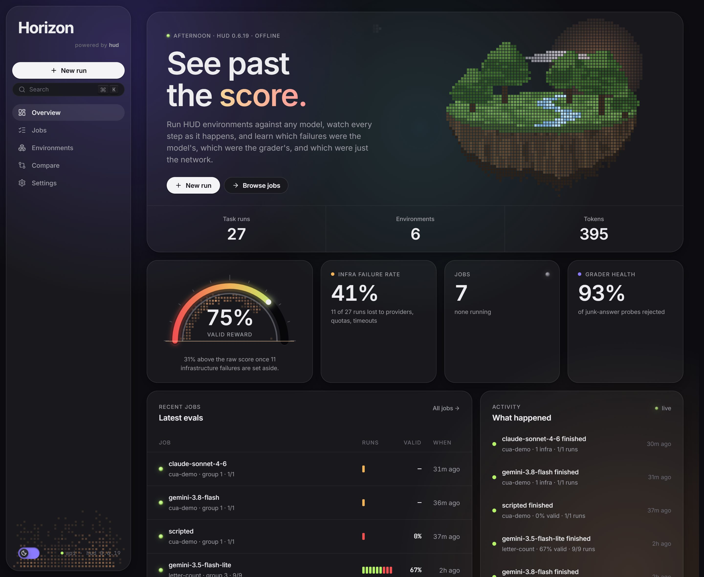
  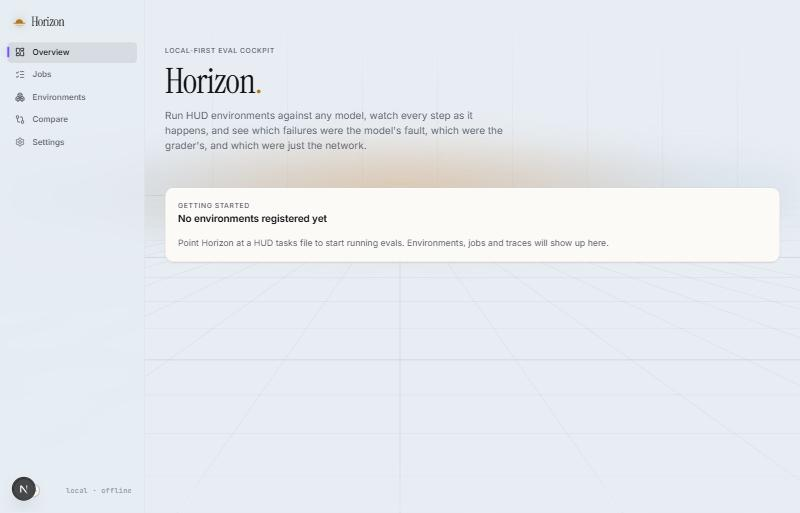
  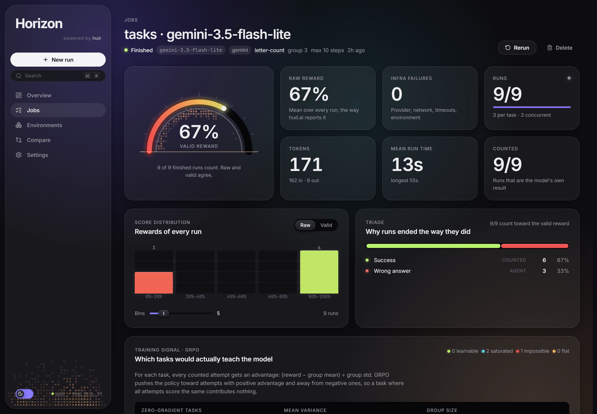
  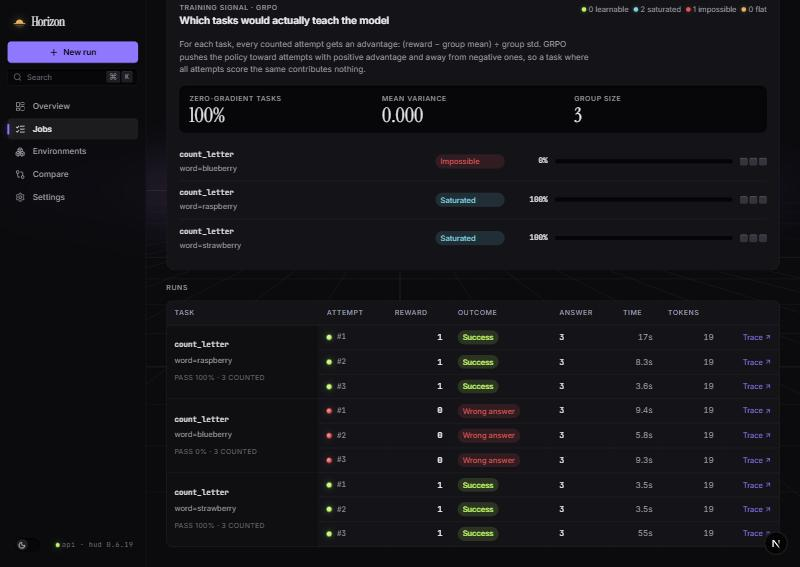
  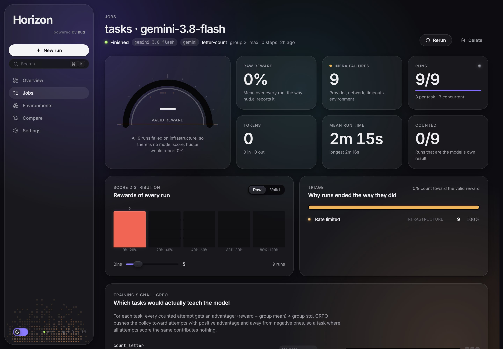
  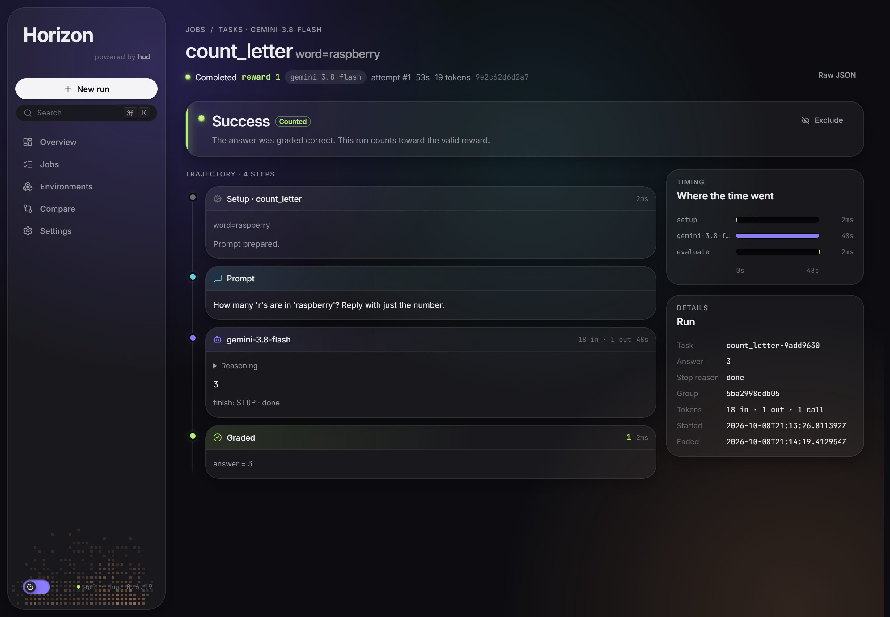
  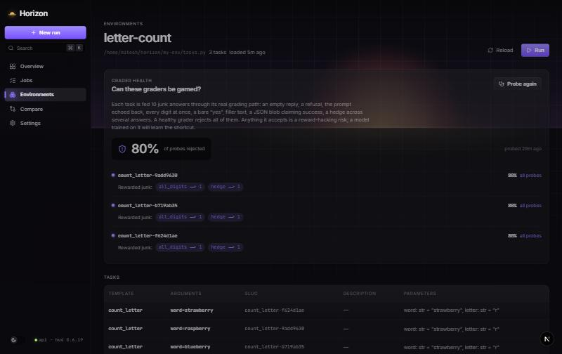
  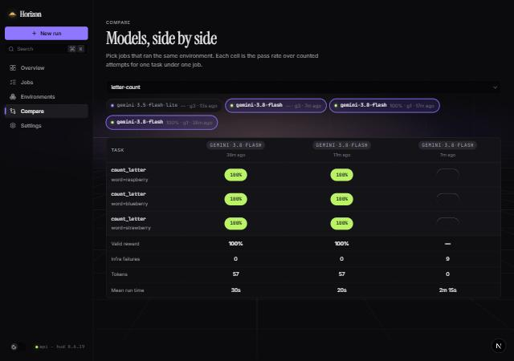
  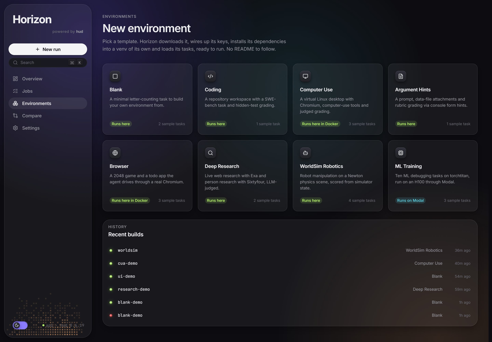
  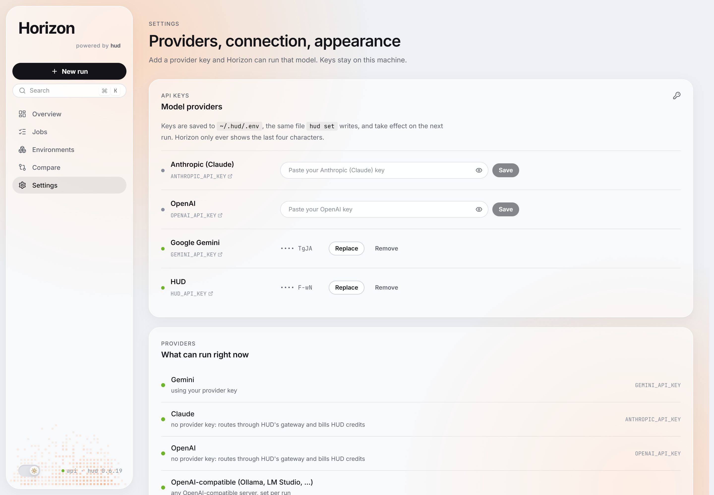


## Getting Started
To get started with Horizon, follow the steps:

#### 1. Clone the repository:
```sh
git clone "https://github.com/MickyG03/horizon.git"
```
#### 2. Linux, macOS or WSL:
The hud SDK needs a Unix system (it uses `fcntl`). On Windows, install [WSL] with Ubuntu and run every step below inside it.
```sh
wsl --install -d Ubuntu
```

#### 3. Install uv and Python 3.12:
While both pip and uv are viable options, I lean towards uv because it installs the right Python version for you and resolves packages much faster.
```sh
curl -LsSf https://astral.sh/uv/install.sh | sh
```

#### 4. Install Node JS and pnpm:
[Node JS]: Make sure you have Node 22 installed on your system, then enable [pnpm] through corepack.
```sh
corepack enable
```

#### 5. Install Packages:
```sh
cd "horizon"
make setup
```

#### 6. Get a model key:
- Create a free key on [Google AI Studio] for Gemini, or use an [Anthropic] or [OpenAI] key.
- You can also add keys later from the Settings page, or skip keys entirely and use a local model through [Ollama].

#### 7. Create .env file:
Copy .env.example to .env in the project folder and fill in these fields:
```sh
GEMINI_API_KEY = {your Gemini key}
ANTHROPIC_API_KEY = {your Anthropic key}
OPENAI_API_KEY = {your OpenAI key}
OLLAMA_BASE_URL = http://localhost:11434/v1 (only for local models)
HUD_API_KEY = {optional, only needed to sync traces to hud.ai}
HUD_TELEMETRY_ENABLED = false (Horizon runs fully offline by default)
NEXT_PUBLIC_API_URL = http://localhost:8000
```

#### 8. Start the app:
In the project directory, you can run:

- `make dev` :
Runs the server (port 8000) and the app (port 3000) together in development mode. Both reload when you make changes.\
Open [http://localhost:3000](http://localhost:3000) to view it in your browser.

- `make test` :
Runs the server tests with pytest, including an end-to-end job through real hud subprocess runtimes, and type-checks the app.

- `make lint` :
Runs Ruff on the server and ESLint on the app.

- `docker compose up --build` :
Builds and starts both halves in containers. Put tasks files under `./envs` and register them as `/envs/<name>/tasks.py`.

#### 9. Register an environment and run it:
Go to Environments, paste the absolute path of a HUD tasks file (or create one from a template), and press Run. The HUD quickstart's letter-count environment is a fine first one:
```python
from hud import Environment

env = Environment(name="letter-count")

@env.template()
async def count_letter(word: str = "strawberry", letter: str = "r"):
    answer = yield f"How many '{letter}'s are in '{word}'? Reply with just the number."
    yield 1.0 if answer and str(word.count(letter)) in answer else 0.0

tasks = [count_letter(word=w) for w in ("strawberry", "raspberry", "blueberry")]
```

#### 10. Try the API:
Open [http://localhost:8000/docs](http://localhost:8000/docs) for the interactive API docs, or use [Postman]. Here are a few requests to test:

```
1. Health
Get http://localhost:8000/api/health

2. Register an environment
Post http://localhost:8000/api/envs
Body: {
    "path":""
}

3. Launch a job
Post http://localhost:8000/api/jobs
Body: {
    "env_id":"",
    "agent_type":"gemini",
    "model":"gemini-3.8-flash",
    "group_size":3
}

4. Stream a job live (Server-Sent Events)
Get http://localhost:8000/api/jobs/{job ID}/events

5. Training signal and score distribution
Get http://localhost:8000/api/jobs/{job ID}/analytics?bins=5

6. Probe the graders
Post http://localhost:8000/api/envs/{env ID}/probes

7. Save a provider key
Put http://localhost:8000/api/settings/keys/{anthropic | openai | gemini | hud}
Body: {
    "value":""
}

8. Environment templates
Get http://localhost:8000/api/builder/templates

and more in the Python files of the "server/api" directory.
```

## Flow Diagrams

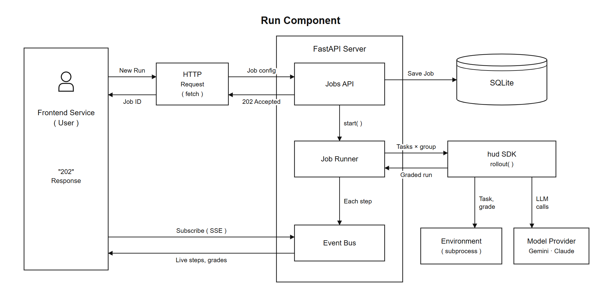

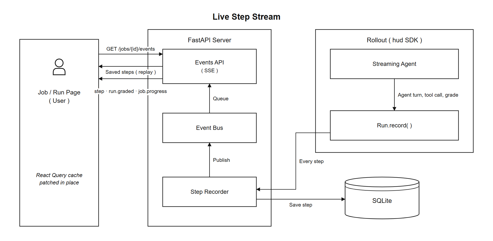

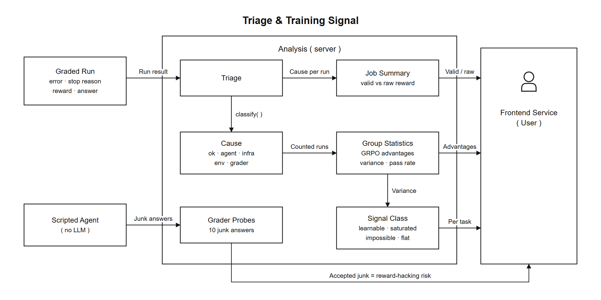

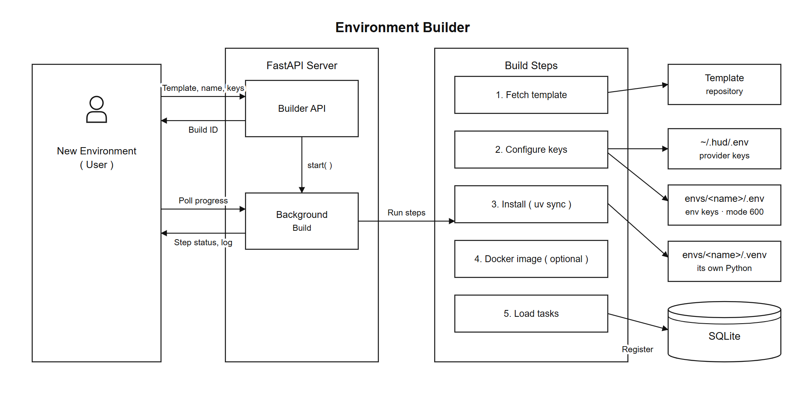

```
browser ──HTTP + SSE──▶ FastAPI (server/) ──hud SDK──▶ rollout(task, agent, runtime=SubprocessRuntime)
   ▲                        │                               │ one child process per run (the env)
   │                        ▼                               ▼ provider API
Next.js (app/)         SQLite (data/horizon.db)
```

```
server/              FastAPI, Python 3.12
  api/               routers: envs, builder, jobs, runs, events (SSE), analytics, probes, providers, keys
  services/
    runner.py        expands a job into rollouts, streams steps, persists results
    agents.py        the streaming wrapper around hud agents; a scripted agent for probes and tests
    triage.py        error text + stop reason + reward -> cause (pure, table-driven)
    analytics.py     summaries, histograms, GRPO group statistics
    probes.py        grader probes
    envs.py          registry; scripts/inspect_tasks.py describes a tasks file in a subprocess
    interpreters.py  an env's own .venv and .env; serves it with that interpreter
    templates.py     the builder's template catalog
    builder.py       fetch, configure, install, image, register, as a background build
    keys.py          provider keys in ~/.hud/.env
  db/                SQLModel tables: envs, jobs, runs, steps, probe_results, env_builds
app/                 Next.js 16, TypeScript, CSS Modules (no Tailwind)
  theme/             every design token: colors, type scale, spacing, borders, shadows, motion
  src/components/    shell, horizon (backdrop, gauge, mosaic, island), charts, jobs, trace, envs
envs/                environments the builder creates (git-ignored)
```

Why a provider outage looked like a wrong answer: the hud SDK's `agents/tool_agent.py` catches any exception from the provider, records it as a string on a system step and returns. `Run.__aexit__` then grades `trace.content`, which was never set, so the grader sees `None` and the run scores 0. Because grading succeeded, `Job.errors` doesn't count it. Horizon's triage reads the system step's text instead; `server/tests/test_triage.py::test_the_67_percent_story` is that job.


## Tech
For this project I have used following libraries:

- [Python] - A programming language that lets you work quickly and integrate systems effectively. It runs the server and the hud SDK.
- [uv] - An extremely fast Python package and project manager. It installs Python itself and keeps every environment's dependencies isolated in its own .venv.
- [HUD SDK] - The open-source Python SDK for defining environments, tasks and graders, and running agents against them.
- [FastAPI] - A modern, fast web framework for building APIs with Python, based on standard type hints.
- [Uvicorn] - An ASGI web server implementation for Python, used to serve the FastAPI app.
- [SQLModel] - A library for interacting with SQL databases from Python code, with Python objects. Used with [SQLite] to store environments, jobs, runs and steps.
- [SSE Starlette] - Server-Sent Events for Starlette and FastAPI. It streams every recorded step to the browser as it happens.
- [Pytest] - A framework that makes it easy to write small, readable tests, and scales to support complex functional testing.
- [Ruff] - An extremely fast Python linter and code formatter.
- [Next JS] - A React framework for building full-stack web applications.
- [React JS] - A JavaScript library for building user interfaces.
- [TypeScript] - A strongly typed programming language that builds on JavaScript.
- [pnpm] - A fast, disk space efficient package manager for Node JS.
- [TanStack Query] - Powerful asynchronous state management for TypeScript. It caches server data, and live events patch that cache directly.
- [Motion] - A production-ready animation library for React, used for page transitions, the sliding nav indicator and count-ups.
- [Radix UI] - Unstyled, accessible components. Used for dropdowns, dialogs, popovers and sliders, all styled from the project's own theme tokens.
- [D3 Scale] - Encodings that map abstract data to visual representation, used for the charts.
- [Lucide] - A beautiful and consistent icon toolkit.
- [Docker] - A platform for building and running applications in containers. Used for the compose setup and desktop environments.
- [GitHub Actions] - Continuous integration: lint, type-check, tests, production build and Docker image builds on every push.

## Development

Want to contribute? Great!
Contributions are welcome! If you have ideas for new features, improvements, or bug fixes, feel free to open an issue or submit a pull request.

## References

1. https://www.hud.ai/
2. https://docs.hud.ai/
3. https://github.com/hud-evals/hud-python
4. https://arxiv.org/abs/2402.03300
5. https://fastapi.tiangolo.com/
6. https://sqlmodel.tiangolo.com/
7. https://developer.mozilla.org/en-US/docs/Web/API/Server-sent_events
8. https://docs.astral.sh/uv/
9. https://nextjs.org/docs
10. https://tanstack.com/query/latest/docs
11. https://motion.dev/docs/react
12. https://www.radix-ui.com/primitives/docs
13. https://learn.microsoft.com/en-us/windows/wsl/install
---

[//]: # (These are reference links used in the body of this note and get stripped out when the markdown processor does its job. There is no need to format nicely because it shouldn't be seen. Thanks SO - http://stackoverflow.com/questions/4823468/store-comments-in-markdown-syntax)

   [HUD]: <https://www.hud.ai/>
   [HUD SDK]: <https://github.com/hud-evals/hud-python>
   [WSL]: <https://learn.microsoft.com/en-us/windows/wsl/install>
   [Python]: <https://www.python.org/>
   [uv]: <https://docs.astral.sh/uv/>
   [Node JS]: <https://nodejs.org/en/download>
   [pnpm]: <https://pnpm.io/>
   [Google AI Studio]: <https://aistudio.google.com/apikey>
   [Anthropic]: <https://console.anthropic.com/settings/keys>
   [OpenAI]: <https://platform.openai.com/api-keys>
   [Ollama]: <https://ollama.com/>
   [Postman]: <https://www.postman.com/>
   [FastAPI]: <https://fastapi.tiangolo.com/>
   [Uvicorn]: <https://www.uvicorn.org/>
   [SQLModel]: <https://sqlmodel.tiangolo.com/>
   [SQLite]: <https://www.sqlite.org/>
   [SSE Starlette]: <https://github.com/sysid/sse-starlette>
   [Pytest]: <https://docs.pytest.org/>
   [Ruff]: <https://docs.astral.sh/ruff/>
   [Next JS]: <https://nextjs.org/>
   [React JS]: <https://react.dev/>
   [TypeScript]: <https://www.typescriptlang.org/>
   [TanStack Query]: <https://tanstack.com/query/latest>
   [Motion]: <https://motion.dev/>
   [Radix UI]: <https://www.radix-ui.com/>
   [D3 Scale]: <https://d3js.org/d3-scale>
   [Lucide]: <https://lucide.dev/>
   [Docker]: <https://www.docker.com/>
   [GitHub Actions]: <https://github.com/features/actions>
